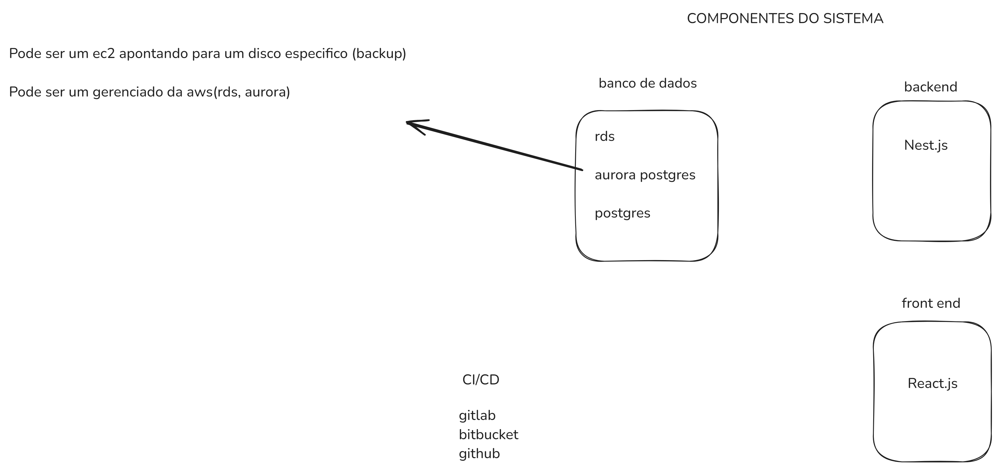
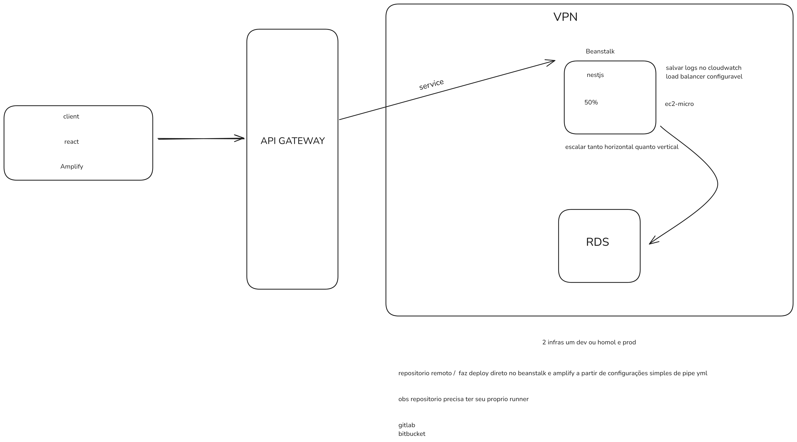
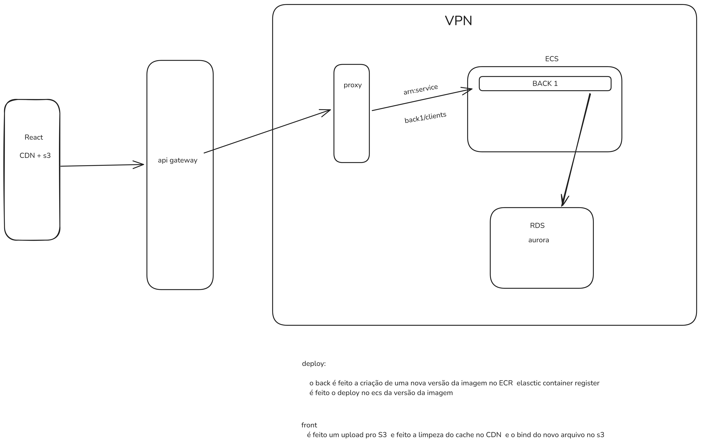

## 🧪 Tecnologias

Esse projeto foi desenvolvido com as seguintes tecnologias:

- [Node](https://nodejs.org/en/)
- [Nestjs](https://nestjs.com)

## 🚀 Como executar

Clone o projeto e acesse a pasta do mesmo.

```bash
$ git clone https://github.com/Brunoocn/teddy-case-backend.git
$ cd teddy-case-backend
```

Para iniciá-lo, siga os passos abaixo:

```bash
# subir a aplicação com o docker
$ docker-compose up --build
```

O server irá subir na porta http://localhost:3000.

Vale lembrar que você deve configurar .env e o .env.prod como o .env.sample

# 📄 Perguntas sobre o desenvolvimento

1. Quanto tempo levaria?
2. Quantos desenvolvedores?
3. Qual a senioridade dos desenvolvedores?

Para responder melhor a pergunta seria necessário ter o prazo da demanda e sua importância.
Como não estava descrito no case, tomei a liberdade de fazer duas simulações.

CASE 1: demanda de grande importancia, para um novo cliente especifico que deve ser entre o quanto antes.

- 1 Sênior no front
- 1 Pleno back

A demanda deve estar pronta em 1 semana, pronta para ser entregue na segunda
dando espaço para resolver eventuais conflitos, ou outras demandas que possam aparecer.

CASE 2:
Demanda tranquila, com prazo de 2 semanas semanas até produção ou uma sprint (2 semanas)

- 1 junior e 1 pleno
  ou
- 2 juniors com auxilio para algumas funções especificas como CI/CD e observabilidade.

Independente dos 2 casos deve ser levado em consideração a equipe no momento e a familiaridade com as tecnologias usadas (curva de aprendizado).

# ⚗️ Arquitetura

# Componentes da arquitetura



# MANEIRA FACIL

- Gerenciada pela AWS
- Elastic Beanstalk.
- Amplify.
- Sobe ec2/sobe loadBalancer/ versionamento.
- Conecta logs com cloudwatch.
- Facil de vincular com o repositorio.
- Auto update on commit.
  <br/>
- Pros
  - Facilidade e agilidade, facil criação e manutenção.
- Contras
  - Por ser gerenciado é mais caro, sobe uma maquina dimensionada anteriormente
    e utiliza regras de load balancer pra fazer upscale.



# MANEIRA BARATA

- Utilizar um ECS (mais barato da AWS).
- Subir o frontend em uma CDN com s3.
- Container mais barato da aws principalmente falando das estancias spot.
- Versionamento de imagem.
- CDN aponta para o build no s3 e faz utilização do cache.
  <br/>
- Pros
  - Principalmente custo e controle.
- Contras
  - Dificuldade inicial, precisa organizar os serviços ou fazer utilização de IaC(terraform,open tofu, cloudformation).
  - Tem necessidade de criar um CI/CD especifico para isso.



# Pontos a serem discutidos
  - LOGS - É possivel usar aws cloud watch, grafana, ou qualquer outro agent do mercado.
  - Tracing - É possivel utilizar o aws x-ray ou subir na mão alguma outra solução open telemtry.
  - VPN (infra fechada)
